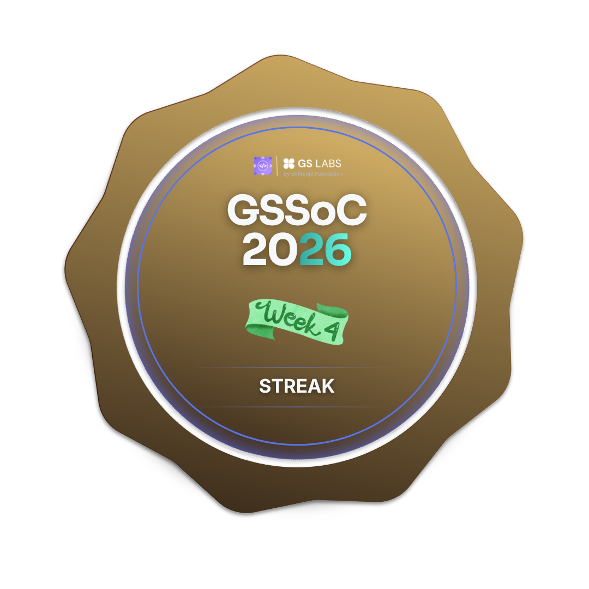

<div align="center">


<!-- Animated Header -->


<br/>

<p>
  
  
  
</p>

</div>

---

## `> whoami`

```js
const mohit = {
  education : "B.Tech @ JK Lakshmipat University, Jaipur",
  currentFocus : ["Open Source (GSSoC 2026)", "Web Dev", "DSA in C++"],
  lifeOutsideCode : ["Building browser games 🎮", "Breaking things & fixing them 🔧"],
  funFact : "My first open source PR got merged — and I haven't stopped since.",
};
```

---

## `> badges --gssoc-2026`

<div align="center">





</div>

---

## `> skills --list`

### ⚡ Languages
<p>
  
  
  
  
</p>

### 🌐 Web
<p>
  
  
  
  
</p>

### 🛠️ Tools & Platforms
<p>
  
  
  
  
  
</p>

---

## `> projects --featured`

| Project | Description | Tech |
|--------|-------------|------|
| 🎮 **Tank Stars Clone** | Browser-based artillery game with physics | HTML · CSS · JS |
| 🧟 **Zombie Survival Shooter** | 3D wave-based shooter, single HTML file | Three.js · JS |
| 🫧 **Bubble Shooter** | Classic bubble popping game in browser | HTML · CSS · JS |
| 📊 **GP Marks Calculator** | Tool for tracking CGPA with localStorage | HTML · JS |

---

## `> github --stats`

<div align="center">


<br/>


</div>

---

## `> activity --contribution-graph`

<div align="center">
  
</div>

---

## `> connect --with-me`

<div align="center">

<a href="https://github.com/Mohit-001-hash">
  
</a>
<a href="https://www.linkedin.com/in/YOUR_LINKEDIN/">
  
</a>

<br/><br/>


</div>

---

<div align="center">
  
</div>
